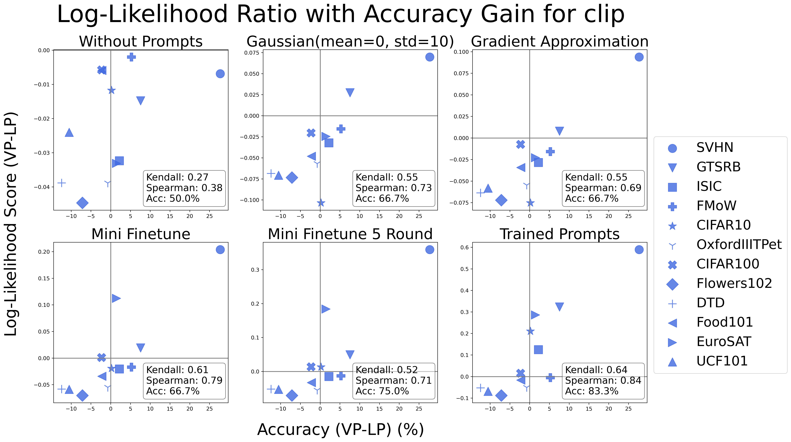

# When Does Visual Prompting Outperform Linear Probing for Vision-Language Models? A Likelihood Perspective

## Overview

This is the official repo for "**When Does Visual Prompting Outperform Linear Probing for Vision-Language Models? A Likelihood Perspective**". Some codes are from [AutoVP](https://github.com/IBM/AutoVP), [LogME](https://github.com/thuml/LogME), [ILM-VP](https://github.com/OPTML-Group/ILM-VP), and [Fourier-Sensitivity](https://github.com/kiranchari/Fourier-Sensitivity-Regularization).

Adapting pre-trained models to new tasks can exhibit varying effectiveness across datasets. Visual prompting, a state-of-the-art parameter-efficient transfer learning method, can significantly improve the performance of out-of-distribution tasks. On the other hand, linear probing, a standard transfer learning method, can sometimes become the best approach. We propose a log-likelihood ratio (LLR) approach to analyze the comparative benefits of visual prompting and linear probing. By employing the LLR score alongside resource-efficient visual prompts approximations, our cost-effective measure attains up to a 100-fold reduction in run time compared to full training, while achieving prediction accuracies up to 91%.

## Experiments

**Complete Evidence Experiments:**

`./exp.sh`

**Evidence Scores Computation with Specified Setting:**

`python3 Evidence.py --dataset "SVHN" --datapath "/DATAPATH/SVHN" --pretrained "resnet18  --mode "gaussain" --img_scale 1.0 --mean 0.0 --std 10.0 --device 0`

-   Parameters in `Evidence.py`:

    -   `dataset` and `datapath`: Name of the dataset and directory path.

    -   `pretrained`: The pre-trained source model.

    -   `img_scale`: The initial image scale. `img_scale=1.0` corresponds to an image size of 128x128.

    -   `seed`: The random seed.

    -   `mode`: The experiment mode includes `lp` for linear probing, `gaussain` for gaussian prompts, `grad` for gradient approximation prompts, `mini_finetune` for mini-finetune prompts, `from_file` for the trained prompts from the given ckpt, and `no_prompt` for the without prompt settings.

    -   `mean`: The gaussian mean for prompts approximation or initialization.

    -   `std`: The gaussian standard deviation for prompts approximation or initialization.

    -   `runs`: The epoch for training the mini-finetune prompts, it will be applied when `mode="mini_finetune"`.

    -   `ckpt_file`: The visual prompting ckpt for compute the evidence of the trained prompts. The format of the ckpt file please refer to [AutoVP](https://github.com/IBM/AutoVP).

    -   `device`: The GPU device.
